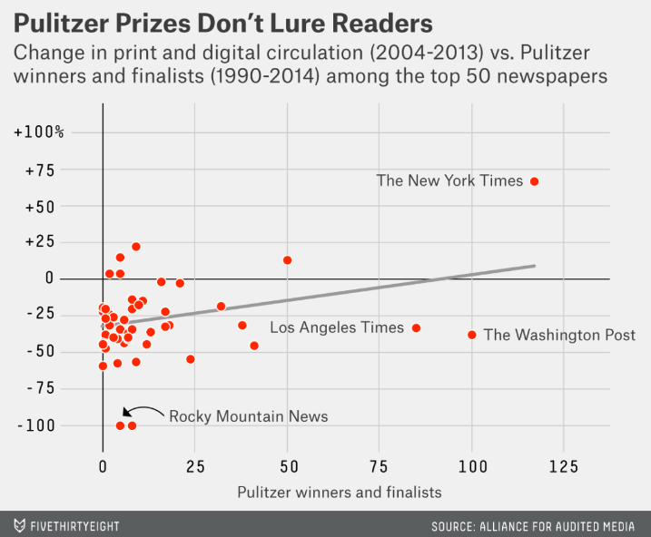
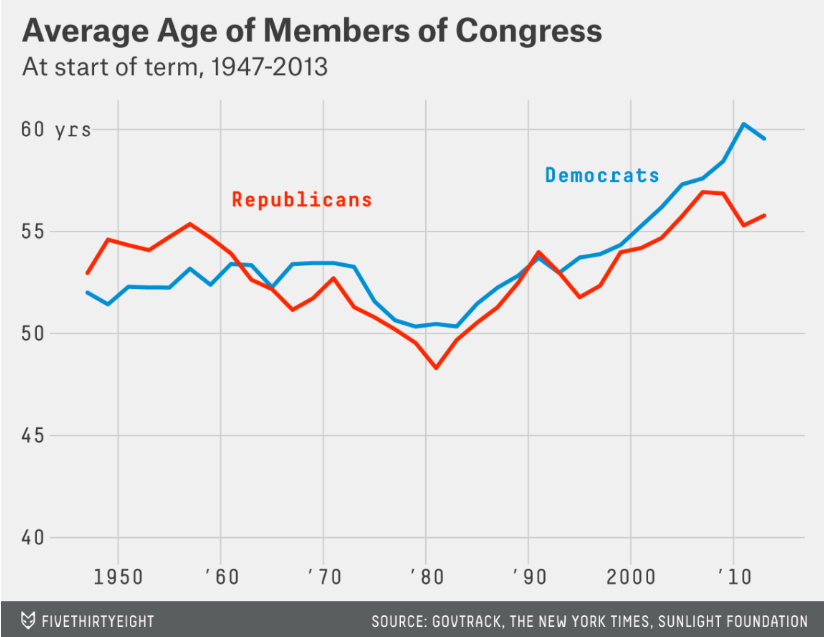

```{r setup, include=FALSE}
knitr::opts_chunk$set(echo = TRUE)
source("./lib/libraries.r", encoding = "UTF-8")
```


## 1. članek: Do Pulitzers Help Newspapers Keep Readers? 

Izbrala sem spodnji graf:

```{r echo=FALSE, out.width='80%'}

```

*Koda za graf, podoben zgornjemu:*

* Najprej popravimo nekaj stvari v grafu:

```{r}
ind<-which(pulitzer$newspaper=="New York Times")

pulitzer$newspaper[ind]<-"The New York Times"
```


* Določimo temo za graf:

```{r}
windowsFonts(pisava=windowsFont("Consolas"))
windowsFonts(stevila=windowsFont("Yu Gothic Medium"))
tema <- function() {
  
    theme(plot.background=element_rect(fill="gray92")) + #ta pobarva tudi za naslovom ozadje
    theme(panel.grid.major = element_line(colour="Gray78")) +
    
    theme(panel.grid.minor = element_blank()) +
  
      #dodelamo naslove, podnaslove in osi:
  
    theme(plot.title = element_text(family="sans",face="bold",
                                    colour="gray24", size=18,hjust = -0.28)) +
  
    theme(plot.subtitle = element_text(family="sans",colour="Gray30",size=13,hjust = -0.45))+
  
    theme(axis.text.y=element_text(family="stevila",face="bold", color="gray13", size=12)) +

    theme(axis.title.x = element_text(family="sans",colour="Gray30",size=12),
          
          axis.text.x = element_text(family="stevila",face="bold", color="gray13", size=12)) +
  
    #odstranimo ticks na oseh:
    
    theme(axis.ticks = element_blank())
  
}
```


* Funkcija, ki obarva glavo puščice (pri segmentu Težave, je naveden link do kode te funkcije, ki je nisem spisala jaz):

```{r}
geom_curve2 <- function(mapping = NULL, data = NULL,
                       stat = "identity", position = "identity",
                       ...,
                       curvature = 0.5,
                       angle = 90,
                       ncp = 5,
                       arrow = NULL,
                       lineend = "butt",
                       na.rm = FALSE,
                       show.legend = NA,
                       inherit.aes = TRUE) {
  layer(
    data = data,
    mapping = mapping,
    stat = stat,
    geom = GeomCurve2,
    position = position,
    show.legend = show.legend,
    inherit.aes = inherit.aes,
    params = list(
      arrow = arrow,
      curvature = curvature,
      angle = angle,
      ncp = ncp,
      lineend = lineend,
      na.rm = na.rm,
      ...
    )
  )
}

GeomCurve2 <- ggproto("GeomCurve2", GeomSegment,
  draw_panel = function(data, panel_params, coord, curvature = 0.5, angle = 90,
                        ncp = 5, arrow = NULL, lineend = "butt", na.rm = FALSE) {
    if (!coord$is_linear()) {
      warning("geom_curve is not implemented for non-linear coordinates",
        call. = FALSE)
    }
    trans <- coord$transform(data, panel_params)

    curveGrob(
      trans$x, trans$y, trans$xend, trans$yend,
      default.units = "native",
      curvature = curvature, angle = angle, ncp = ncp,
      square = FALSE, squareShape = 1, inflect = FALSE, open = TRUE,
      gp = gpar(
        col = alpha(trans$colour, trans$alpha),
        fill = alpha(trans$colour, trans$alpha),
        lwd = trans$size * .pt,
        lty = trans$linetype,
        lineend = lineend),
      arrow = arrow
    )
  }
)
```

* Narišemo graf in mu dodamo temo, ki smo jo skonstruirali v zgornji kodi:

```{r}
graf1 <- ggplot(pulitzer,aes(x=num_finals1990_2014, y=pctchg_circ)) +
  
  #geome rišemo v vrstnem redu kot hočemo da se prekrivajo:
  #narisani x in y osi:
  
  geom_hline(yintercept=0,color="gray32",size = 0.7) +
  geom_vline(xintercept = 0,colour="gray32",size = 0.7) +

  #narišemo linearno regresijo:
  
  geom_smooth(method="lm",se=FALSE,color="Gray65") +
  
  #dodamo pike, obarvamo kot na zgornjem grafu:
  
  geom_point(aes(fill="spr"), position = "jitter", colour="white",
             pch=21,size=3) + #tu colour določi obrobo pik (samo če je pch med 21-25)
  
  scale_fill_manual(values="red1") + #obarvamo notranjost pik
  
  guides(fill=FALSE) + #umaknemo legendo, ki jo dobimo s fill
  
  #uredimo velikost osi, dodamo naslov, poimenujemo osi:
  
  coord_cartesian(xlim=c(-5,138))+
  
  labs(title="Pulitzer Prizes Don't Lure Readers",
       subtitle =paste(strwrap("Change in print and digital circulation (2004-2013) vs. Pulitzer winners and finalists (1990-2014) among the top 50 newspapers"),collapse="\n"), 
       x="Pulitzer winners and finalists", y="") +

  #določena skala na oseh:

  scale_x_discrete(limits=c(0, 25,50,75,100,125), 
                   expand = c(0.03,0)) +
  scale_y_continuous(limits=c(-110,100), 
                     breaks=c(-100,-75,-50,- 25,0,25,50,75,100),
                     labels=c(-100,-75,-50,- 25,0,"+25","+50","+75","+100%"),
                   expand = c(0.03,0)) +
  
 #dodamo oznake na tiste točke, ki jih želimo označiti:
  
  geom_text(data=subset(pulitzer, pulitzer$num_finals1990_2014>75),
            aes(x=num_finals1990_2014, y=pctchg_circ,
            label=newspaper), hjust=1.07, vjust=0.3, colour="Gray30", 
            size=4.5, check_overlap = TRUE) +
  
  geom_text(aes(x=42,y=-92,label="Rocky Mountain News"),
            family="sans", size=4.5, colour="Gray30") +
  
  geom_text(aes(x=122.5,y=-37,label="The Washington Post"),family="sans",
            size=4.5, colour="Gray30") +
  
  #dodamo puščico:
  
  geom_curve2(aes(x = 19, y = -92, xend = 5, yend = -93), 
              color = "black", 
              arrow = arrow(type="closed",length = unit(0.25,"cm")),
              lwd=0.5) + #length nam določi dolžino glave puščice
  
  tema()

graf1 
```

* **Težave in razlike:**

* Malce več težav sem imela z iskanjem oblikovanja pik, saj so na originalnem grafu obrobljene belo, kar pa je mogoče samo takrat ko je znotraj **geom_dot()** argument **pch** enak od 21-25.

* Ko sem iskala funkcijo za risanje osi, sem najprej poskušala s funkcijo **theme(axis.line)**. Odločla sem se za lažjo pot in sem osi narisala z **geom_hline()** in **geom_vline()**.

* Probleme sem imela tudi z nameščanjem oznak na pike, saj sem jih morala dodajati posamezno. Funkcije, ki jih bi namestila use hkrati in tako kot v originalnem grafu nisem našla. Je pa funkcija **geom_text()** zelo uporabna.

* Manjša težava je določiti katera pisava, ter katere velikosti je le ta, pa tudi katere barve uporabiti, da zadanemo barve originalnega grafa.

* Razmike osi od grafa (argument **expand**), podnaslov, oblikovanje naslovov, osi in mrežnih črt sem našla hitro, ter aplicirala brez problema. 

* Manjši problem je nastal pri uporabi **geom_curve** in argumentu **arrow(type="closed")**, ki ni pobarval tudi glave puščice. Poskusila sem z argumentom **arrow.fill**, kar je vrnilo napako, da ne obstaja. Na **Stackoverflow** sem dobila zgornjo funkcijo **geom_curve2()**, ki obarva glavo puščice. (Vir funkcije/ link: https://stackoverflow.com/questions/47878787/fill-arrow-on-geom-curve-ggplot2 )

* Razlike so predvsem v pisavi, saj nisem našla prave pisave, ter rahel zamik 2. vrstice podnaslova.


## 2. članek: Both Republicans And Democrats Have an Age Problem

Izbrala sem slednji graf iz tega članka:

```{r echo=FALSE, out.width='80%'}

```

*Koda za graf, podoben zgornjemu:*

* Izberemo samo kongresnike, ki so bodisi republikanci bodisi demokrati:

```{r}
indeksi1<-which(congress_age$party=="D")
indeksi2<-which(congress_age$party=="R")

congress_age<-congress_age[c(indeksi1,indeksi2),]
```


* Najprej smo pripisali letnico vstopa v kongres vsakemu kongresniku:

```{r}
congress_age$leto<-1947

letnice<-names(table(congress_age$termstart))

for (i in 1:length(letnice)){
    ind=which(as.Date(as.character(congress_age$termstart))==as.Date(letnice[i]))
    congress_age$leto[ind]<-1947+2*(i-1)
}

```

* Izračunati je potrebno še povprečna leta za kongresnike v posameznem letu:

```{r}
demokrati<-c()
republikanci<-c()

for (i in seq(1947,2013,2)){
  podatki<-subset(congress_age,party=="D")
  podatki1<-subset(congress_age,party=="R")
  kongR=which(podatki1$leto==i)
  dolR=length(kongR)
  starR=sum(podatki1$age[kongR])/dolR
  republikanci=append(republikanci,starR)
  kongD=which(podatki$leto==i)
  dolD=length(kongD)
  starD=sum(podatki$age[kongD])/dolD
  demokrati=append(demokrati,starD)
}
```

* Naredimo novo tabelo:

```{r}
l<-seq(1947,2013,2)
kongres<-data.frame(c(l,l),c(rep("Democrats",34),rep("Republicans",34)),c(demokrati,republikanci))

colnames(kongres)<-c("leta","stranka","age")
```

* Določimo temo za graf:

```{r}
tema1 <- function() {
  
    theme(plot.background=element_rect(fill="gray92")) + #ta pobarva tudi za naslovom ozadje
    theme(panel.grid.major = element_line(colour="Gray78",size=.5)) +
    
    theme(panel.grid.minor = element_blank()) +
  
      #dodelamo naslove, podnaslove in osi:
  
    theme(plot.title = element_text(family="sans",face="bold",
                                    colour="gray24", size=18,hjust = -0.14)) +
  
    theme(plot.subtitle = element_text(family="sans",colour="Gray30",size=13,hjust = -0.06))+
  
    theme(axis.text.y=element_text(family="stevila", color="gray13", size=13)) +

    theme(axis.text.x = element_text(family="stevila", color="gray13", size=13)) +
  
    #odstranimo ticks na oseh:
    
    theme(axis.ticks = element_blank())
  
}
```

* Narišemo graf:

```{r}
ggplot(kongres,aes(leta,age,group=stranka, colour=stranka))+geom_line(size=1.2)+
   
  scale_colour_manual(values = c("deepskyblue3","red1"))+
  
  guides(colour=FALSE) +
  
  #uredimo velikost osi, dodamo naslov, poimenujemo osi:
  
  coord_cartesian(ylim = c(40,60))+
  
  labs(title="Average Age of Members of Congress",
       subtitle ="At start of term, 1947-2013",
       x="", y="") +

  #določena skala na oseh:

  scale_x_continuous(limits=c(1946,2013), 
                     breaks=c(1950,1960,1970,1980,1990,2000,2010),
                     labels=c(1950,"'60","'70","'80","'90",2000,"'10")) +
  scale_y_discrete(limits=c(40,45,50,55,60),expand = c(0.1,0)) +
  
 #dodamo oznake na tiste točke, ki jih želimo označiti:
  
  geom_text(aes(x=1998,y=57.8,label="Democrats"),
            family="pisava", size=4.5, colour="deepskyblue3") +
  
  geom_text(aes(x=1967,y=56.8,label="Republicans"),family="pisava",
            size=4.5, colour="red1") +
  
  geom_text(aes(x=1946,y=60,label="yrs"),family="stevila",
            size=4.5, colour="Gray30") +
  
  tema1()
```


* **Težave in razlike:**

* Veliko težav, ki sem jih imela pri prvem grafu, pri tem grafu nisem imela, saj sem odgovore dobila že pri prvem grafu.

* Ena od težav, na katere sem naletela pri obeh grafih so bili fonti pisav, saj mi jih, kljub temu da sem iskala večkrat, ni uspelo najti pravega

* **tema1** ki sem jo ustvarila za drugi graf, je precej podobna temi za prvi graf

* Razlika med grafoma je tudi v besedi **yrs**, saj sem jo dodala z **geom_text**, namesto z **label(.....,"60 yrs")**, saj so zamiki na osi tako bolj podobni originalnemu grafu.